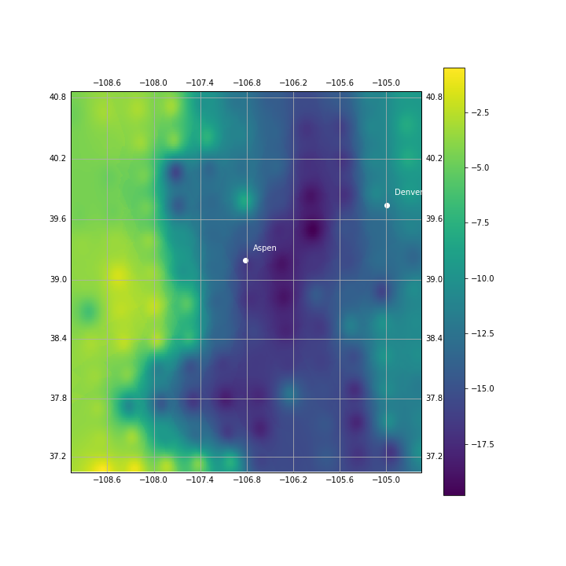

# Visualizing Organismal Thermal Stress
[**Tony Cannistra**](anthonycannistra.com) | [See Visualization](cse512-18s.github.io/organismal-thermal-stress/)

## Summary Proposal 

Anthropogenic climate change is having a dramatic effect on earth’s natural systems. To maintain functional ecosystems and preserve biodiversity in this changing world, the conservation community has come to rely on computational models to inform decision making. One particular class of model, known as a “biophysical model,” uses mathematical representations of energy balance and organism-environment heat transfer to translate environmental conditions into organismal body temperatures. From laboratory experiments with myriad cold-blooded species (that is, organisms that rely on behavior and the environment for temperature regulation), we know that organisms are sensitive to certain body temperature thresholds (”biophysical thresholds”) above or below which their performance (i.e. ability to eat, move, reproduce) is limited. When an organism’s body temperature crosses one of these thresholds (i.e. goes below a lower threshold or above a high threshold), we consider the organism to be experiencing “thermal stress.”

From our lab in the Department of Biology I have access to several decades of daily (noontime) body temperature values for several cold-blooded species (butterflies/lizards) in a 30km grid across the state of Colorado. By applying a biophysical threshold to these body temperatures, we can obtain a binary thermal stress classification. For this project I intend to visualize the spatial and temporal dimensions of this thermal stress. Are there locations which are particularly stressful for organisms? What percentage of an organisms’ known range is experiencing stressful conditions today/this year/this decade? Working in collaboration with my advisor Dr. Lauren Buckley, I intend to build a visualization which helps to elucidate answers to these questions using model output from our lab.

## Project Progression

### 1: Create Data Pipeline

These data are in XYZ point files, which I need to convert to rasters (for model output) and spatial polygons (for thermally-stressed area). I implement a prototype in Python/GDAL in [`notebooks/Grid + Visualize.ipynb`](./notebooks/Grid + Visualize.ipynb). The production code lives in [`notebooks/process_Te.py`](./notebooks/process_Te.py) and [`notebooks/get_area.py`](./notebooks/get_area.py).

### 2: Static Visualization Prototype

For a sanity check I'm creating a static viz of just body temperatures. 

### 3: Dynamic Visualization Prototype

The dynamic visualization allows users to brush across recent history and view the body temperatures, stress zones, and land surface area experiencing stress using a time slider. Using D3.js and Mapbox.js I've implemented the dynamic visualization.

### 4: Creating production-ready data

I ran the above data pipeline from step 1 on real, daily model output for a historical decade of data to create the daily components for the web visualization. This took about 7 hours of 4-core compute. I host these components on AWS S3 for quick retrieval and easy access. 

## Process Commentary

The development of this project encountered two primary challenges: data volume and visualization implementation. The model produces hourly body temperature data for a 30km grid across the continental U.S. for several decades. This is on the order of ~150GB of data, which is far too large to quickly deploy onto a web visualization. Furthermore, the 30km grid size is simply too large for a compelling visualization, so the data required spatial interpolation to tell a compelling story.

In addition, the the data from the model is in an `(lon,lat,temp)` comma-separated file format, which is not a standard for spatial data (and therefore cannot be easily used and processed by available geospatial tools in Javascript, like D3 and Mapbox. This meant that I was required to project the data to a GeoTIFF raster format and compute the thermal stress polygons for use in the web visualizsation. These GeoTIFFs, while maintaining the raw data, were still too large for quick interaction, so I ended up creating GIF images for each data point after applying a colormap to the normalized body temperature data. 

Still the data volume remained too high for both the technical implementation and the visualization objective. Since our operationalized timeline is over decades of data, hourly information is not relevant, so I chose a single data point for each modeled day (Noon) as the representation of thermal stress for a given day. I applied a biophysical threshold to this data point to create a thermal stress polygon (as a `.geojson` file) for each data point. 

Once these GIF images and `.geojson` polygons were created, I developed a web visualization to interactively brush across the decade of stress data and load the necessary information to display a selected day. The primary challenge of this viz development was refamiliarizing myself with Javascript and learning some of the idiosyncracies of D3, especially with regard to the brushing interaction (which was helped along significantly by [this tutorial from Mike Bostock](https://bl.ocks.org/mbostock/6498000)).

